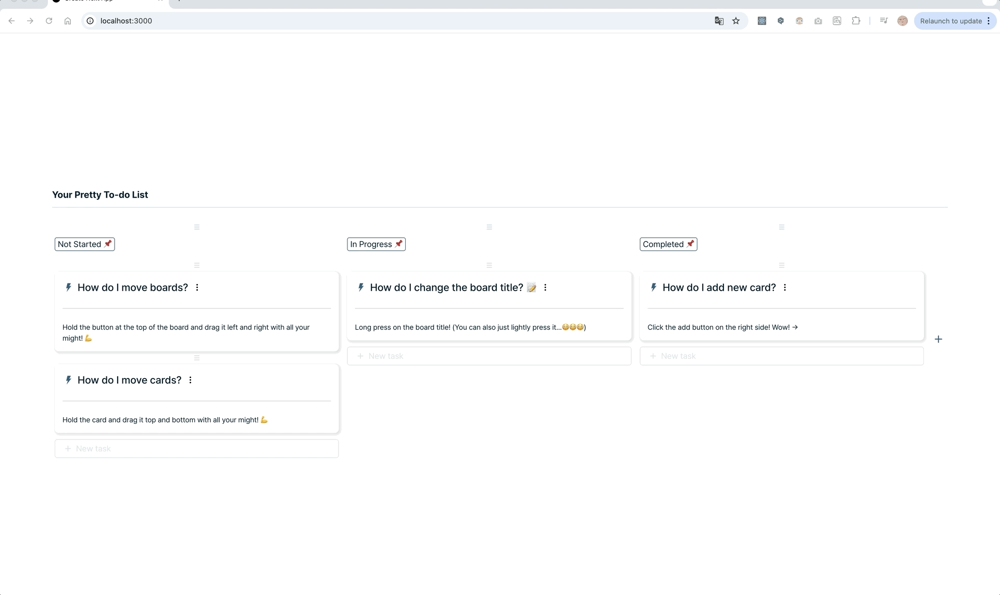
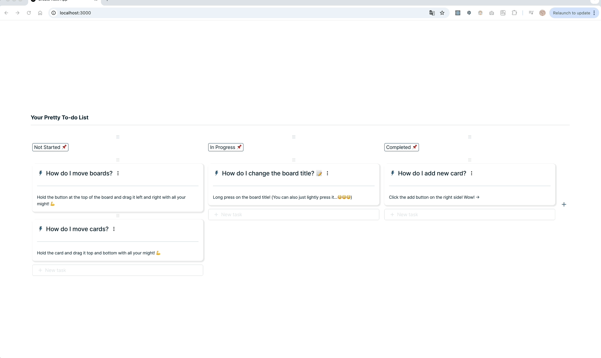

_과제 형태의 프로젝트이기 때문에 `.env` 파일을 Ignore 하지 않았습니다._

## 프로젝트 소개

<p>
Your Pretty To-Do List는 칸반 스타일의 To-Do 리스트 관리 웹 애플리케이션입니다.
Next.js 15, TypeScript, Tailwind CSS를 기반으로 개발되었으며, React Query를 활용한 데이터 관리와
dnd-kit을 이용한 드래그 앤 드롭 기능을 통해 직관적인 사용자 경험(UX)을 제공합니다.

본 프로젝트는 글로벌널리지 프론트엔드 개발자 채용 과제 수행을 위해 제작되었으며,
보드 및 할 일(Task)의 생성, 수정, 삭제, 이동 기능을 포함하여 실제 업무에서 활용할 수 있는 칸반 시스템을 구현하는 것을 목표로 합니다.

</p>

## 목차

- [과제 목표 및 달성](#과제-목표-및-달성)
- [주요 기능](#주요-기능)
- [기술 스택](#기술-스택)
- [프로젝트 구조](#프로젝트-구조)
- [Figma 목업](#figma-목업)
- [데모](#데모)
- [주요 개발 과정과 고민](#주요-개발-과정과-고민)
  - [Drag & Drop 기능 구현](#drag-and-drop-implementation)
  - [Next.js 15 사용](#nextjs-15-implementation)
  - [Hydration 개념 이해](#hydration-implementation)
  - [UI/UX](#ui-ux-design)
- [실행 방법](#실행-방법)

<br>

## 과제 목표 및 달성

**기본 요건**

- [✔] ~~Next.js (14.x.x ~ 15.x.x) 사용~~
- [✔] ~~Tailwind CSS (3.x.x) 사용~~
- [✔] ~~TypeScript 적용~~

**To-Do 보드**

- [✔] ~~보드 생성, 수정, 삭제 가능~~
- [✔] ~~보드 순서 변경 가능 (Drag & Drop 적용)~~

**To-Do 할일**

- [✔] ~~할 일 생성, 수정, 삭제 가능~~
- [✔] ~~보드 내에서 할 일 순서 변경 가능~~
- [✘] ~~보드 간 할 일 이동 기능 미완성~~

<br>

## 주요 기능

- **Drag & Drop 지원**: `dnd-kit`을 활용하여 칸반보드 구현
- **SSR & CSR 최적화**: Next.js 15에서 `HydrationBoundary`와 `React Query` 활용
- **React Query로 상태 관리**: 서버 데이터 동기화 및 캐싱 처리
- **반응형 UI**: Tailwind CSS를 활용한 반응형 디자인

<br>

## 기술 스택

| 역할        | 기술 스택        |
| ----------- | ---------------- |
| 프레임워크  | **Next.js 15**   |
| 언어        | **TypeScript**   |
| 스타일링    | **Tailwind CSS** |
| 상태 관리   | **React Query**  |
| Drag & Drop | **dnd-kit**      |

<br>

## 프로젝트 구조

```bash
📂 src
├── 📂 app                    # Next.js App Router 구조
│   ├── 📂 api                # API Routes (Next.js API 서버)
│   │   ├── 📂 boards         # 보드 관련 API
│   │   │   └── route.ts
│   │   ├── 📂 tasks          # 할 일(Task) 관련 API
│   │   │   └── route.ts
│   ├── layout.tsx            # 전체 레이아웃 설정
│   ├── page.tsx              # 메인 페이지
│   └── providers.tsx         # 글로벌 프로바이더 설정
│
├── 📂 components             # UI 컴포넌트 모음
│   ├── 📂 board              # 보드 관련 컴포넌트
│   │   ├── BoardColumn.tsx
│   │   ├── BoardContainer.tsx
│   │   └── DraggableBoardColumn.tsx
│   ├── 📂 card               # 할 일(Task) 관련 컴포넌트
│   │   ├── DraggableTaskCard.tsx
│   │   └── TaskCard.tsx
│   ├── 📂 common             # 재사용 가능한 공통 컴포넌트
│   │   ├── Button.tsx
│   │   └── IconButton.tsx
│   └── 📂 icons              # 아이콘 컴포넌트
│       └── SvgIcon.tsx
│
├── 📂 config                 # 설정 및 상수 관리
│   ├── boardsData.ts         # 초기 보드 데이터
│   ├── constants.ts          # 전역 상수
│   └── svgPaths.ts           # SVG 아이콘 경로
│
├── 📂 hooks                  # 커스텀 훅 모음
│   ├── useBoard.ts           # 보드 관련 훅
│   └── useTask.ts            # 할 일(Task) 관련 훅
│
├── 📂 services               # API 통신 모듈
│   ├── 📂 api                # API 호출 함수들
│   │   ├── boardApi.ts
│   │   └── taskApi.ts
│   └── apiClient.ts          # API 요청 공통 함수
│
├── 📂 styles                 # 글로벌 스타일 파일
│   └── globals.css
│
├── 📂 types                  # TypeScript 타입 정의
│   ├── board.ts
│   ├── icon.ts
│   └── task.ts
│
└── 📂 utils                  # 유틸리티 함수 모음
```

<br>

## Figma 목업


<br>

## 데모

<div align="center">
  
  <p><em>보드 생성 데모</em></p>
</div>

<div align="center">
  
  <p><em>보드 수정 데모 1</em></p>
</div>

<div align="center">
  
  <p><em>보드 수정 데모 2</em></p>
</div>

<div align="center">
  
  <p><em>보드 삭제 데모</em></p>
</div>

<div align="center">
  
  <p><em>할 일 생성 데모</em></p>
</div>

<div align="center">
  
  <p><em>할 일 수정 데모</em></p>
</div>

<div align="center">
  
  <p><em>할 일 수정 데모</em></p>
</div>

<div align="center">
  
  <p><em>할 일 삭제 데모</em></p>
</div>

<br>

## 주요 개발 과정과 고민

<details>
  <summary id="drag-and-drop-implementation">Drag & Drop 기능 구현</summary>

  <br>

사용자 경험을 극대화하기 위해 dnd-kit을 선택 히였습니다. 처음에는 드래그 앤 드롭 기능을 직접 구현할까 생각했지만, dnd-kit이 제공하는 직관적인 API와 높은 커스터마이징 능력과 한정된 시간 내에 일정치의 결과물을 만들어야 하는 프로젝트의 요구사항에 완벽히 부합했습니다. 특히, dnd-kit은 가벼운 패키지와 다양한 드래그 앤 드롭 기능은 시나리오를 쉽게 구현할 수 있도록 도와주었습니다. 이러한 장점들은 사용자에게 자연스럽고 매끄러운 인터랙션을 제공하는 데 큰 도움이 되었으리라 생각합니다.

</details>

<details>
  <summary id="nextjs-15-implementation">Next.js 15 사용</summary>

  <br>

사용자 경험을 극대화하기 위해 dnd-kit을 선택 히였습니다. 처음에는 드래그 앤 드롭 기능을 직접 구현할까 생각했지만, dnd-kit이 제공하는 직관적인 API와 높은 커스터마이징 능력과 한정된 시간 내에 일정치의 결과물을 만들어야 하는 프로젝트의 요구사항에 완벽히 부합했습니다. 특히, dnd-kit은 가벼운 패키지와 다양한 드래그 앤 드롭 기능은 시나리오를 쉽게 구현할 수 있도록 도와주었습니다. 이러한 장점들은 사용자에게 자연스럽고 매끄러운 인터랙션을 제공하는 데 큰 도움이 되었으리라 생각합니다.

</details>

<details>
  <summary id="hydration-implementation">Hydration 개념 이해</summary>

  <br>

이번 프로젝트를 진행하면서 Hydration 개념을 직접 다루게 된 것이 특히 흥미로운 경험이었습니다. 기존에는 주로 클라이언트 사이드 렌더링(CSR) 방식으로 개발해 왔기 때문에, 서버에서 렌더링된 HTML을 클라이언트에서 재활용하는 과정에서 발생하는 문제를 깊이 이해할 기회가 없었습니다. 하지만 Next.js를 사용하면서, 서버에서 미리 렌더링된 페이지를 클라이언트에서 어떻게 다시 활성화하는지, 그리고 이 과정에서 데이터 불일치가 발생하면 Hydration 오류가 발생할 수 있다는 점을 알게 되었습니다.

특히, 초기에는 React Query의 initialData를 사용해 서버에서 데이터를 미리 주입하려 했지만, 클라이언트에서 다시 데이터를 요청하는 과정에서 서버와 클라이언트의 상태가 불일치하는 문제가 발생했습니다. 이를 해결하기 위해 dehydrate()와 Hydrate() 기법을 적용하여, 서버에서 가져온 데이터를 클라이언트에서도 동일하게 유지하는 방식으로 개선하였습니다. 이를 통해 불필요한 API 요청을 줄이면서도 Hydration 오류를 방지할 수 있었고, Next.js의 서버와 클라이언트의 데이터 연속성을 유지하는 방법에 대해 보다 깊이 이해하게 되었습니다.

단순히 새로운 기술을 적용하는 것을 넘어, Next.js의 SSR과 클라이언트 상태 관리가 어떻게 연결되는지 직접 실험하고 최적화하는 과정이 매우 신기하고 재미있었으며, 이러한 개념을 활용하면 더 확장성 있는 애플리케이션을 만들 수 있다는 점이 인상적이었습니다.

</details>

<details>
  <summary id="ui-ux-design">UI/UX </summary>

  <br>

이번 프로젝트에서는 단순한 기능 구현을 넘어, 사용자가 직관적으로 조작할 수 있는 UI/UX 설계에 많은 고민을 기울였습니다. 특히, 버튼의 위치나 레이아웃 구성은 사용자의 행동 흐름을 고려하여 배치해야 했기 때문에 여러 번 수정과 테스트를 거쳤습니다.

예를 들어, 새로운 보드를 추가하는 버튼의 위치는 초기에는 각 보드의 상단에 배치했지만, 사용자가 보드를 확장할 때 가독성이 떨어지고 동선이 길어지는 문제가 있었습니다. 이를 해결하기 위해 보드 리스트 끝 부분에 배치하여 자연스럽게 새로운 보드를 추가하도록 유도하는 방식으로 변경하였습니다.

또한, 할 일을 추가하는 버튼과 삭제하는 버튼의 위치도 중요한 고민 요소였습니다. 초반에는 할 일(Task) 내부에 아이콘 버튼으로 배치했지만, 삭제 버튼이 너무 눈에 띄어 실수로 클릭하는 경우가 발생할 가능성이 높았습니다. 이를 보완하기 위해 기본적으로 숨겨두었다가, 사용자가 특정 영역에 마우스를 올릴 때만 나타나도록 구현하여 실수로 삭제하는 일을 방지했습니다.

뿐만 아니라, 보드와 태스크 이동 시 자연스러운 경험을 제공하기 위해 드래그 앤 드롭 인터랙션의 피드백을 강화했습니다. 태스크를 드래그할 때 살짝 떠오르는 효과와 함께 컬럼의 배경색이 강조되도록 조정하여, 사용자가 현재 수행하는 동작을 직관적으로 이해할 수 있도록 했습니다.

이러한 레이아웃과 인터랙션에 대한 고민을 거듭하면서, 단순한 할 일 관리 툴이 아닌 사용자가 능동적으로 활용할 수 있는, 조작이 편리하고 직관적인 칸반 보드를 만들 수 있었습니다.

</details>

<br>

## 실행 방법

1. 프로젝트 클론

```bash
git clone https://github.com/koreanerd/JoBeen_ToDoPage.git
```

2. 패키지 설치

```bash
pnpm install
```

3. 개발 서버 실행

```bash
pnpm dev
```

4. 프로덕션 빌드 & 실행

```bash
pnpm build
pnpm start
```

5. 테스트 실행
